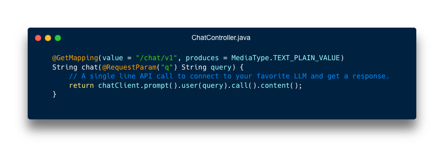

# Spring AI in action

This project showcases the use of [Spring AI](https://spring.io/projects/spring-ai)
to bring AI features to your Spring application.

Using Spring AI, you can leverage a wide range of AI providers
(such as OpenAI, Mistral AI, Google Gemini and many others) along with additional services
such as vector databases.

Spring AI provides an abstraction layer over AI providers API: this way you can focus
on your code by using the same API, no matter what AI provider you pick.



This repository includes a few demos you can run to learn about Spring AI.

## How to build and run this app?

You need Java 21+ to build and run this app. 

Use this command to build the app:

```shell
./mvnw clean package
```

Before running this app, make sure you have Docker daemon running,
along with Docker Compose.

Use this command to bootstrap a Redis database
(which is used by some demos available in this app):

```shell
docker compose up
```

You can run this app using this command:

```shell
./mvnw spring-boot:run
```

The app will automatically bind to the Redis database running as a container.

## AI providers

This application has been tested with 3 AI providers:

- OpenAI with `gpt4o`
- Mistral AI with `open-mixtral-8x22b`
- Ollama (local) running Mistral AI with model `mistral`

Please note that those models are not created equal: some features (such as function calling)
may not properly work depending on the model you pick.

You may run this app with additional AI providers and/or models, providing you add the right
Spring AI dependency provider in the file [pom.xml](pom.xml) along with the configuration.

### OpenAI

You need an OpenAI API key to run this app.
[Refer to this page](https://help.openai.com/en/articles/4936850-where-do-i-find-my-openai-api-key)
to create and get an API key.

Set your API key as an environment variable:

```shell
export OPENAI_API_KEY=xxxxxx
```

Set `openai` as the AI provider:

```shell
export APP_AI_PROVIDER=openai
```

### Mistral AI

You need a Mistral AI API key to run this app.
[Refer to this page](https://console.mistral.ai/api-keys/)
to create and get an API key.

Set your API key as an environment variable:

```shell
export MISTRALAI_API_KEY=xxxxxx
```

Set `mistralai` as the AI provider:

```shell
export APP_AI_PROVIDER=mistralai
```

### Ollama (local)

Using [Ollama](https://www.ollama.com/) you can run a LLM on your workstation.
Follow [these instructions](https://www.ollama.com/download) to download and install Ollama.

Start Ollama using this command:

```shell
ollama serve
```

Use this command to download the Mistral AI model for Ollama

```shell
ollama pull mistral
```

## Demos

### Chat API

[Basic use](src/main/java/com/broadcom/tanzu/demos/springai101/chat/ChatV1Controller.java)
of the Spring AI `ChatClient`:

```shell
http ":8080/chat/v1?q=How are you today?"
```

[Prompt templating](src/main/java/com/broadcom/tanzu/demos/springai101/chat/ChatV2Controller.java):

```shell
http ":8080/chat/v2?topic=devops"
```

[Stateless chat conversations](src/main/java/com/broadcom/tanzu/demos/springai101/hello/HelloController.java):

```shell
http ":8080/hello"
```

[Stateful chat conversations](src/main/java/com/broadcom/tanzu/demos/springai101/hello/HelloController.java)
(keep track of previous messages):

```shell
http ":8080/hello-memory"
```

[Converting chat responses](src/main/java/com/broadcom/tanzu/demos/springai101/chat/ChatV3Controller.java)
to Java entities:

```shell
http ":8080/chat/v3?topic=devops"
```

Same as above with content negotiation (prioritizing XML output):

```shell
http ":8080/chat/v3?topic=devops" Accept:text/xml
```

### Retrieval Augmented Generation (RAG)

[Load and index data](src/main/java/com/broadcom/tanzu/demos/springai101/movies/MovieDatasetLoader.java)
(this task actually processes input files in background):

```shell
http ":8080/movies/init"
```

[Create a new movie](src/main/java/com/broadcom/tanzu/demos/springai101/movies/MoviesController.java)
using 2 movie titles:

```shell
http ":8080/movies?titles=Lord of the Rings,Despicable Me"
```

Same as above but using genre drama (default is comedy):

```shell
http ":8080/movies?titles=Furiosa,Snow White&genre=drama"
```

Same as above but translating the result into french:

```shell
http ":8080/movies?titles=Ghostbusters,Despicable Me&genre=drama&lang=fr"
```

Clear the database (make sure you restart the app after running this command):

```shell
redis-cli flushdb
```

### Function Calling

Verify that the AI provider has no way to figure out current weather
if no function is registered:

```shell
http ":8080/chat/v1?q=Should I bring my sunglasses when I'll get to Paris later today?"
```

[Call an inline function](src/main/java/com/broadcom/tanzu/demos/springai101/weather/WeatherV1Controller.java):

```shell
http ":8080/weather/v1?city=Paris"
```

[Call a function](src/main/java/com/broadcom/tanzu/demos/springai101/weather/WeatherV2Controller.java)
and map the result to a Java entity:

```shell
http ":8080/weather/v2?city=Paris"
```

[Using functions](src/main/java/com/broadcom/tanzu/demos/springai101/weather/WeatherV3Controller.java),
verify that the AI provider can now answer weather related questions:

```shell
http ":8080/weather/v3?q=Should I bring my sunglasses when I'll get to Paris later today?"
```

Same as above but using a complex query involving many cities:

```shell
http ":8080/weather/v3?q=Sort the top 5 most populated cities in France by temperature."
```

### Multimodal Prompts

[Combining text, image and functions](src/main/java/com/broadcom/tanzu/demos/springai101/weather/WeatherV4Controller.java)
to answer a question, mapping the result to a JSON structure:

```shell
http ":8080/weather/v4?u=https://live.staticflickr.com/65535/53783195627_283a3ae09d_c_d.jpg"
```

## Contribute

Contributions are always welcome!

Feel free to open issues & send PR.

## License

Copyright &copy; 2024 [Broadcom, Inc. or its affiliates](https://vmware.com).

This project is licensed under the [Apache Software License version 2.0](https://www.apache.org/licenses/LICENSE-2.0).
